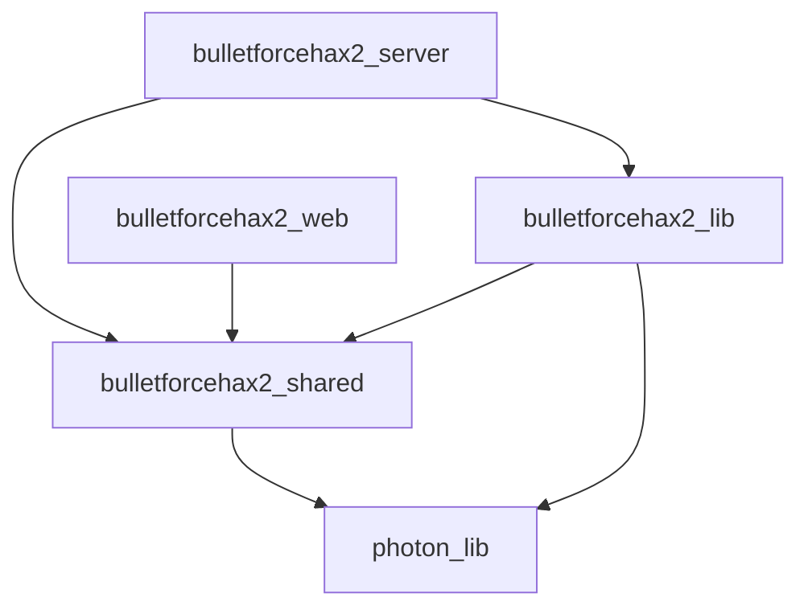

[toc]

# Project structure

This project contains/will contain the following crates:
- `bulletforcehax2_server`: A binary project that starts the web server that hosts BulletForceHax.
- `bulletforcehax2_web`: An egui-based UI to control BulletForceHax from the browser. This is hosted by the server.
- `bulletforcehax2_shared`: Shared communication structures between the server and the web project.
- `bulletforcehax2_lib`: The core logic of BulletForceHaxV2.
- `photon_lib`: Low-level implementation of the Photon network protocol.

Dependency graph:


# Getting a copy of Photon Unity Networking (PUN)

Bulletforce currently uses Photon v1.99 from 2019. This is not the latest version of Photon 1, so you cannot dowload it from the asset store anymore.
However, with some [creative searching](https://cs.github.com/?scopeName=All+repos&scope=&q=language%3Acsharp+versionPUN+%3D+%221.99%22), you can find versions uploaded on github such as [here](https://github.com/OpenHogwarts/hogwarts/tree/master/Assets/Photon%20Unity%20Networking).

It seems that Photon v1.99 and Photon v1.106 (current version as of time of writing) don't have many differences. It may be easiest to install the latest version in Unity and use an IDE to navigate through it.

It may also be useful to use a program such as [WinMerge](https://winmerge.org/) to see what exactly changed between versions.

# Finding packets from logging

Requirements:
- [jq](https://stedolan.github.io/jq/) or [Nushell](https://www.nushell.sh/)

In debug builds, the BulletForceHax app will log all incoming and outgoing messages to its json logs. You can read and filter them using [jq](https://stedolan.github.io/jq/).


For example, to find all EventData messages with code 229
```sh
cat bfhax_data/logs/log_20221013_120000.json | jq -r '.fields | select(.message_code == 229 and .message_type == "EventData") | .message_data'
```

## Nushell
If you use Nushell, you can source the `commands.nu` file to get the `bfh_find_packet` command:
```nu
C:\Users\HoLLy\Projects\Rust\BulletForceHaxV2〉bfh_find_packet EventData 229 | get 0
EventData(
    EventData {
        code: 229,
        parameters: {
            222: Hashtable(
...
```

NOTE: the dependency on `jq` can probably be removed when using nu. If you're reading this, feel free to open a PR :)

# Checking code coverage on photon_lib
Requirements:
- Just (`cargo install just` or [install as package](https://just.systems/man/en/chapter_4.html))
- grcov (`cargo install grcov` or [download the binary](https://github.com/mozilla/grcov/releases))
- rust llvm tools (`rustup component add llvm-tools-preview`)

Generate code coverage info by running `just cover-photon` in the repo root. This will generate an HTML page at `target/coverage/html/index.html` and an `lcov.info` file in the repo root. Editor extensions such as `ryanluker.vscode-coverage-gutters` for VS Code can make use of these files to show inline coverage info.

If this method does not work on windows, try using WSL.
