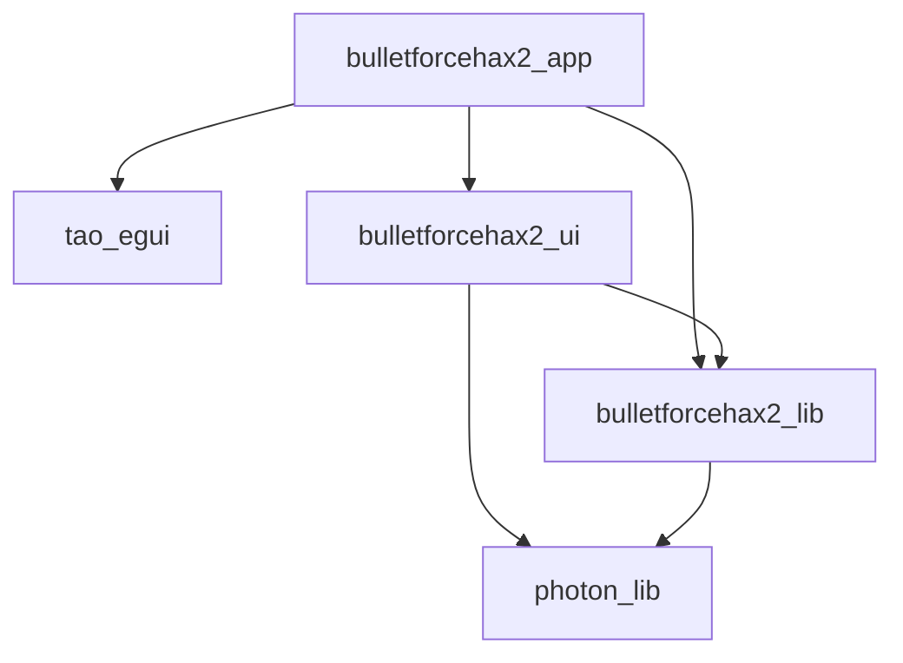

# Project structure

This project contains/will contain the following crates:
- `bulletforcehax2_app`: Runnable app. This spawns a webview with the game loaded and automatically runs BulletForceHaxV2 in the background.
- `bulletforcehax2_ui`: egui-based UI code for controlling BulletForceHaxV2.
- `bulletforcehax2_lib`: The core logic of BulletForceHaxV2.
- `photon_bulletforce`: Conversion of photon types to bulletforce types.
- `photon_lib`: Low-level implementation of the photon network protocol.
- `tao_egui`: Utility crate to run an egui app alongside the webview in `bulletforcehax2_app`.

Dependency graph:

# Checking code coverage
Requirements:
- Just (`cargo install just` or [install as package](https://just.systems/man/en/chapter_4.html))
- grcov (`cargo install grcov` or [download the binary](https://github.com/mozilla/grcov/releases))
- rust llvm tools (`rustup component add llvm-tools-preview`)

Generate code coverage info by running `just cover-photon` in the repo root. This will generate an HTML page at `target/coverage/html/index.html` and an `lcov.info` file in the repo root. Editor extensions such as `ryanluker.vscode-coverage-gutters` for VS Code can make use of these files to show inline coverage info.

If this method does not work on windows, try using WSL.
