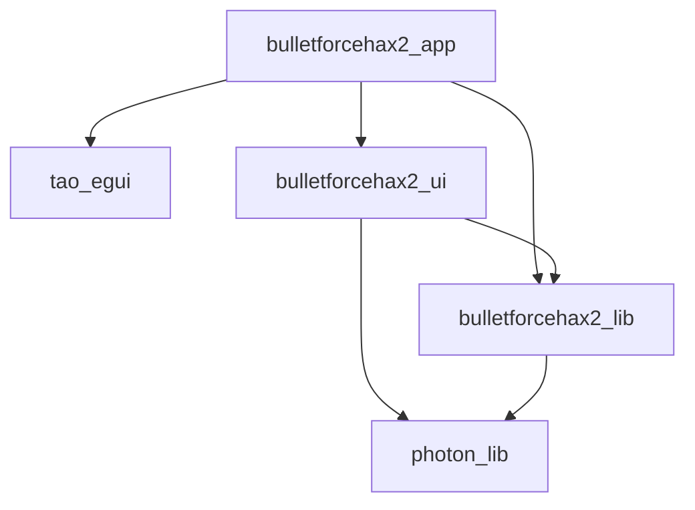

# Project structure

This project contains/will contain the following crates:
- `bulletforcehax2_app`: Runnable app. This spawns a webview with the game loaded and automatically runs BulletForceHaxV2 in the background.
- `bulletforcehax2_ui`: egui-based UI code for controlling BulletForceHaxV2.
- `bulletforcehax2_lib`: The core logic of BulletForceHaxV2.
- `photon_bulletforce`: Conversion of photon types to bulletforce types.
- `photon_lib`: Low-level implementation of the photon network protocol.
- `tao_egui`: Utility crate to run an egui app alongside the webview in `bulletforcehax2_app`.

Dependency graph:


# Figuring out packet structure

Requirements:
- [jq](https://stedolan.github.io/jq/)
- [Nushell](https://www.nushell.sh/) (optional)

In debug builds, the BulletForceHax app will log all incoming and outgoing messages to its json logs. You can read and filter them using [jq](https://stedolan.github.io/jq/).


For example, to find all EventData messages with code 229
```sh
cat bfhax_data/logs/log_20221013_120000.json | jq -r '.fields | select(.message_code == 229 and .message_type == "EventData") | .message_data'
```

## Nushell
If you use Nushell, you can source the `commands.nu` file to get the `find_log` command:
```nu
C:\Users\HoLLy\Projects\Rust\BulletForceHaxV2〉find_log EventData 229 | get 0
EventData(
    EventData {
        code: 229,
        parameters: {
            222: Hashtable(
```

NOTE: the dependency on `jq` can probably be removed when using nu. If you're reading this, feel free to open a PR :)

# Checking code coverage
Requirements:
- Just (`cargo install just` or [install as package](https://just.systems/man/en/chapter_4.html))
- grcov (`cargo install grcov` or [download the binary](https://github.com/mozilla/grcov/releases))
- rust llvm tools (`rustup component add llvm-tools-preview`)

Generate code coverage info by running `just cover-photon` in the repo root. This will generate an HTML page at `target/coverage/html/index.html` and an `lcov.info` file in the repo root. Editor extensions such as `ryanluker.vscode-coverage-gutters` for VS Code can make use of these files to show inline coverage info.

If this method does not work on windows, try using WSL.
